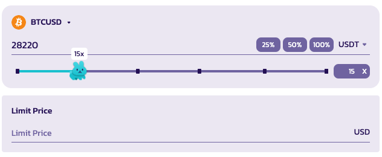
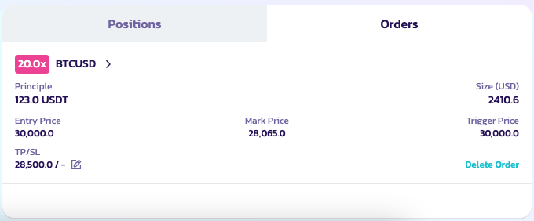
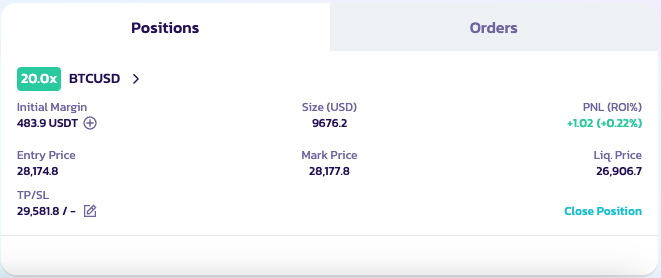

# How can I use it?

Using this functionality is really easy (the difficult thing is to trade well). We will only have to follow a series of steps so that our experience is complete. For more information, please visit the [V2 Glossary](perpetuals-glossary.md).

### Go to Perpetual Trading page&#x20;

You can enter from the [site](https://pancakeswap.finance), in the Trade → Perpetual section, or through this [link  ](https://perp.pancakeswap.finance/en/futures/BTCUSDT)

### Choose the pair to trade&#x20;

You can select a tradable pair by clicking on the arrow next to the pair, at the top of the page.

<figure><figcaption></figcaption></figure>

More tradable pairs will come soon!

<figure><figcaption></figcaption></figure>

### Analyze the chart and decide your trading strategy

It’s trading time!! Let’s get serious. You can analyze the chart your way, with all the tools available

<figure><figcaption></figcaption></figure>

**Do you know how to do it or do you want to improve in your analysis?**

Here is a guide to get started in the world of chart analysis:

* [How to Use TradingView on Binance Website](https://www.binance.com/en/support/faq/8419126024404348a1c6e4039fbed3fe)
* [Candlestick charts](https://academy.binance.com/en/articles/a-beginners-guide-to-candlestick-charts)
* [Trend Lines Explained](https://academy.binance.com/en/articles/trend-lines-explained)

### Make your position&#x20;

Then, in the upper right part you have the board to position your order.

<figure><figcaption></figcaption></figure>

Here you must set several parameters, like:

_Not in an specific order_

1. Long Or Short&#x20;

<figure><figcaption></figcaption></figure>

Select the trade position you would like to adopt

&#x20; 2\. The x of the leverage

<figure><figcaption></figcaption></figure>

Move the bunny to select the appropriate leverage position. You can also manually enter the position in the box on the left.

Disclaimer: Remember that a high level of leverage carries a very high risk, use it wisely.

&#x20;   3\. Type or Order

<figure><figcaption></figcaption></figure>

&#x20;  4\. Set the order size and place a price for your order (For limit orders)

You can also choose the reference currency to see your position.

5. Take Profit/Stop Loss & Slippage

<figure><figcaption></figcaption></figure>

Users can set a take profit or stop loss price when opening a position.

* Take Profit: Users' position will be liquidated once they reach the set upon P\&L percentage gain.
* Stop Loss: Users' position will be liquidated once they reach the set upon P\&L percentage loss.
* Slippage: Used to cancel a market order automatically if the price moved too fast in the direction of the trade before it was opened. For example if you wish to market long the current price but before your trade is opened the price moved up 1%, it will cancel automatically.

Note: You can hover over each option for more information. Please refer to [Perpetuals V2 Glossary](perpetuals-glossary.md) for an in-depth guide.

### Send your order

When all the parameters have been set, you can send the order by clicking on Open Position

### Checking your position

Once the order has been sent, it will appear in "Open Orders" until filled out.

### Live!

When it is filled, your position will be live. You can see it in the positions panel. Also you can view, edit, or close it.

Good luck with your trades!
