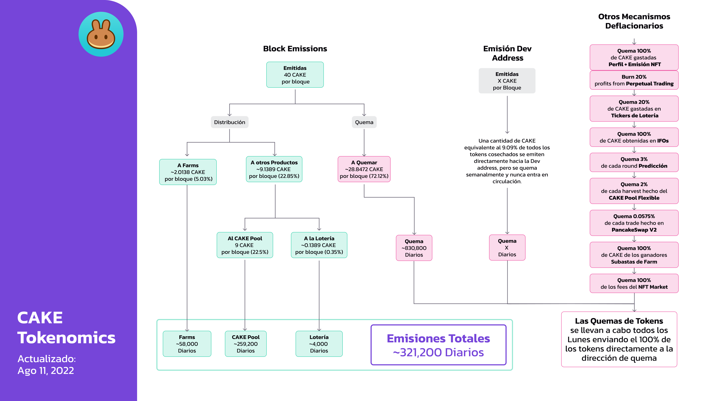

# Tokenomics de CAKE

## **Tasa de Emisión** 

### **Por Bloque**

| **Metric**                                                                  | **Emisión/Bloque (CAKE)** | **Emisión/día (CAKE)** |
| --------------------------------------------------------------------------- | ------------------------: | ---------------------: |
| Emisión                                                                     |                        40 |              1,152,000 |
| Quemado Semanal [(PID 138)](cake-tokenomics.md#why-is-the-cake-burn-manual) |                   \~28.85 |              \~830,800 |
| **Emisión Efectiva**                                                        |             **\~11.16\*** |        **\~321,200\*** |


El 11 de Agosto, 2022, los Chefs implementaron algunas actualizaciones para poder exprimir al máximo las ventajas del MasterChef v2. Eliminaron la necesidad de quemar por separado 45,000 CAKE perteneciente a las inyecciones de lotería. Esa tarea es ahora manejada directamente por el MasterChef v2 en las quemas semanales de CAKE. Gracias a esto, la emisión efectiva es aún menor.


Además de lo anterior, también se emite una cantidad dinámica de CAKE a la [Dev Address](https://www.bscscan.com/address/0xd4cfec77cdc21573982ec85cf33cfde6cc677e74) a una tasa de 9.09%. Esto significa que si se cosechan 100 CAKE, entonces 9.09 CAKE se emiten además y se envían a la Dev Address


**Sin embargo, todo el CAKE emitido a la Dev Address se quema en la quema semanal y nunca entra en circulación. Como tal, no lo hemos incluido en la tasa de emisión anterior.**


## Distribución 

| Distribuido                      | Reward/bloque (% de emisión) | Reward/bloque (CAKE Total) | Reward/Día           |
| -------------------------------- | ---------------------------- | -------------------------- | -------------------- |
| Farms                            | \~5.03%                      | \~2.0138                   | 58,000 (approx)      |
| Lotería                          | \~0.35%                      | \~0.1389                   | 4,000 (approx)       |
| Syrup Pools                      | \~22.5%                      | \~9                        | 259,200 (approx)     |
| **Emisión Diaria Total de CAKE** | ​                            | ​                          | **321,200 (approx)** |


El proceso de quema es manual. [Ve las transacciones aquí](https://bscscan.com/token/0x0e09fabb73bd3ade0a17ecc321fd13a19e81ce82?a=0x000000000000000000000000000000000000dead).


## Por qué es manual la quema?

Para comenzar a funcionar, PancakeSwap se lanzó como MVP (producto mínimo viable) con el contrato de MasterChef emitiendo 40 CAKE por bloque. Por esa razón, el primer equipo no agregó funciones adicionales, como la capacidad de personalizar la lógica de emisión de CAKE. Como migrar a un nuevo MasterChef requeriría mucho tiempo y esfuerzo, el equipo optó por reducir las emisiones de CAKE a través de un proceso de quema manual mediante la creación de dos pools:

* Legacy Lottery Pool (PID - 137) - CAKE quemada de la Lotería
* Burn Pool (PID - 138) - CAKE quemada por bloque

Estos pools funcionan de manera similar a los Farms, donde los Chefs pueden ajustar el porcentaje de los 40 CAKE por bloque asignados después de cada voto de reducción de emisiones de CAKE.


El día de la quema, el supply que se muestra en la página de inicio podría saltar repentinamente en varios millones de CAKE.&#x20;

No te preocupes, este **CAKE NUNCA ENTRA EN CIRCULACIÓN**


Este salto aparente se debe a cómo se almacena todo el CAKE que se asigna para la quema durante la semana.

El CAKE enviado a ambos grupos PID-137 y PID-138 se cosecha antes de completar las quemas semanales de tokens, y esto hace que el supply total que se muestra en el sitio salte en \~ 6M. Esto se debe a que el CAKE pendiente no se registra en el Suministro Total hasta que se cosecha el día de la quema. Una vez que se completa la transacción de quema de tokens, el \~6M se muestra en Quemado hasta la fecha.

## **Otros Mecanismos Deflacionarios** 

En la actualidad, también se quema CAKE de las siguientes maneras:

* **0.0575%** de cada trade en PancakeSwap V2
* **100%** de CAKE enviada a la Dev address
* **100%** de CAKE obtenida de performance fees en IFOs
* **100%** de CAKE gastada en creación de Perfiles y NFTs emitidos
* **100%** of CAKE obtenida en las Subastas de Farm
* **20%** de CAKE gastada en Tickets de Lotería
* **20%** de las ganancias de Perpetual Trading
* **45,000** CAKE por día (históricamente asignadas a la lotería) &#x20;
* **3%** de cada ronda Predicción con BNB se utiliza para comprar CAKE y quemar
* **3%** de cada ronda de Predicción con CAKE
* **2%** de cada cosecha en el Pool de CAKE Flexible
* **2%** de cada venta del NFT Market es usada para comprar y quemar CAKE

## Cómo confirmar el Supply por uno mismo

Para confirmar que el supply de CAKE que se muestra en la página de inicio de PancakeSwap es correcto:

1. Ve al contrato de token CAKE en BscScan y mira [cuánto CAKE tiene la dirección de burn](https://bscscan.com/token/0x0e09fabb73bd3ade0a17ecc321fd13a19e81ce82#balances). Esa es la cantidad total de CAKE que se ha quemado (eliminado de la circulación PARA SIEMPRE, e imposible de recuperar).
2. Luego, reste esta cantidad quemada del "Supply total" que muestra BscScan.
3. Eso brinda el Supply actual de CAKE

**Lea más sobre la mecánica deflacionaria de CAKE en la página siguiente.**
